# ☸️ CI/CD GitOps Pipeline: Jenkins + Ansible + K3s + ArgoCD + Observability on AWS

[](#-demo-videos)

[](https://aws.amazon.com/)
[](https://k3s.io/)
[](https://www.docker.com/)
[](https://www.jenkins.io/)
[](https://www.ansible.com/)
[](https://argo-cd.readthedocs.io/)
[](https://helm.sh/)
[](https://traefik.io/)
[](https://letsencrypt.org/)
[](https://prometheus.io/)
[](https://grafana.com/)
[](https://grafana.com/oss/loki/)
[](https://www.postgresql.org/)
[](https://nodejs.org/)

<details>
<summary><strong>📑 Table of Contents (Click to expand)</strong></summary>

- 📌 [Introduction](#introduction)
- 🚀 [Key Features](#key-features)
- 🏗️ [Architecture Overview](#architecture-overview)
- 📁 [Project Structure](#project-structure)
- 🛠️ [Technologies Used](#technologies-used)
- 🎬 [Demo Videos](#demo-videos)
- ☁️ [AWS Infrastructure Setup](#aws-infrastructure-setup)
- 💻 [Quick Start](#quick-start)
- ✅ [1. CI Pipeline Auto-Trigger via Webhook](#step-1)
- 🔄 [2. ArgoCD GitOps Auto-Sync](#step-2)
- 🔒 [3. Custom Domain & Valid HTTPS Certificate](#step-3)
- 📊 [4. Observability: Prometheus + Grafana + Loki](#step-4)
- 🌐 [5. Live Application Demo](#step-5)
- ⚠️ [Troubleshooting & Lessons Learned](#troubleshooting-lessons-learned)
- 🔮 [Production Gaps & Future Improvements](#future-production-improvements)
- 👤 [Author](#author)

</details>

---

<h2 id="introduction">📌 Introduction</h2>

This repository documents a complete, self-built **CI/CD GitOps pipeline** deployed on a **2-server AWS EC2 setup** (Management + Target), fully driven from scratch — no managed Kubernetes service, no managed CI service.

The project demonstrates end-to-end DevOps practices: **Infrastructure provisioning** (AWS EC2 + Security Groups), **Configuration Management** (Ansible bootstrapping K3s + Helm), **Continuous Integration** (Jenkins, triggered automatically via GitHub Webhook), **GitOps Continuous Delivery** (ArgoCD auto-syncing from a dedicated config repo), **automated HTTPS** (cert-manager + Let's Encrypt across every exposed UI), and **full-stack Observability** (Prometheus, Grafana, Loki with a custom application dashboard).

Every stage was built, broken, and debugged manually — see the [Troubleshooting section](#troubleshooting-lessons-learned) for the 15 real-world issues encountered and resolved along the way.

---

<h2 id="key-features">🚀 Key Features</h2>

*   🔁 **Fully Automated CI/CD Loop**: `git push` → GitHub Webhook triggers Jenkins → build & push Docker image → Jenkins auto-commits the new image tag to the GitOps config repo → ArgoCD detects the change and deploys — zero manual steps after the initial push.
*   ⚙️ **Infrastructure Automation with Ansible**: K3s + Helm bootstrapped remotely on the Target Server via an idempotent Ansible playbook run from the Management Server, including automatic kubeconfig fetch and IP rewriting.
*   🔐 **Automated HTTPS Everywhere**: `cert-manager` + Let's Encrypt issues and auto-renews valid TLS certificates for the application, ArgoCD UI, and Grafana UI — each behind its own subdomain via Traefik Ingress.
*   📈 **GitOps-Driven Deployment**: ArgoCD continuously reconciles the live cluster state against the `devops-gitops-config` repository, with Auto-Sync and Self-Heal enforcing Git as the single source of truth.
*   📊 **Custom Observability Stack**: Prometheus Operator (`kube-prometheus-stack`) scrapes application metrics via a dedicated `ServiceMonitor`, Loki + Promtail centralize logs, and a custom Grafana dashboard visualizes pod count, CPU, memory, and live error logs.

---

<h2 id="architecture-overview">🏗️ Architecture Overview</h2>

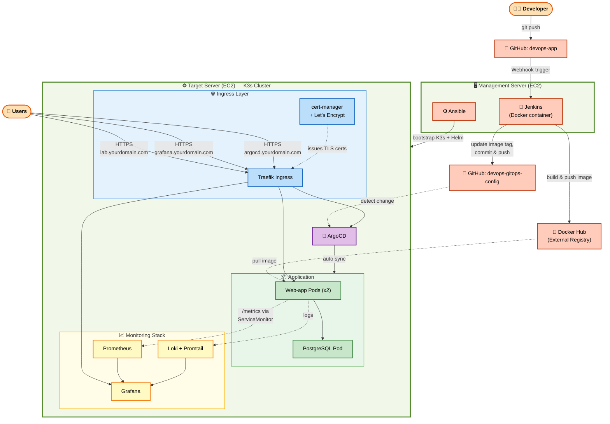

---

<h2 id="project-structure">📁 Project Structure</h2>

```text
devops-cicd-gitops-lab/
├── README.md
├── .gitignore
├── docs/
│   └── screenshots/                # 10 verification screenshots referenced below
│
├── app/                             # Application source (CI-facing repo)
│   ├── Jenkinsfile                  # 3-stage pipeline: checkout → build/push → update GitOps config
│   └── app/
│       ├── server.js                # Node.js/Express app + prom-client metrics endpoint
│       ├── package.json
│       └── Dockerfile
│
├── gitops-config/                   # GitOps state (repo watched by ArgoCD)
│   ├── postgres.yaml                # PostgreSQL Deployment + Service
│   └── web-app.yaml                 # Web-app Deployment (Prometheus annotations) + Service
│
└── infra/                           # Ansible & cluster manifests
    ├── hosts.ini                    # Ansible inventory
    ├── bootstrap-k3s.yml            # Playbook: install K3s + Helm, fetch kubeconfig
    ├── cluster-issuer.yaml          # cert-manager ClusterIssuer (Let's Encrypt)
    ├── web-app-ingress.yaml         # Ingress + TLS for the application
    ├── grafana-ingress.yaml         # Ingress + TLS for Grafana
    ├── argocd-ingress.yaml          # Ingress + TLS for ArgoCD
    └── web-app-servicemonitor.yaml  # Prometheus Operator ServiceMonitor
```

> **Note:** In the live environment, `app/` and `gitops-config/` are separate Git repositories (`devops-app` and `devops-gitops-config`) — Jenkins polls the former via webhook, ArgoCD watches the latter. They are consolidated here into a single showcase repository for portfolio readability.

---

<h2 id="technologies-used">🛠️ Technologies Used</h2>

| Component | Technology / Badge | Description |
|---|---|---|
| **Cloud Provider** |  | 2x EC2 instances (`t3.medium`) — Management Server (Jenkins + Ansible) and Target Server (K3s cluster) |
| **Orchestration** |  | Lightweight Kubernetes (K3s), bootstrapped remotely via Ansible |
| **Configuration Mgmt** |  | Idempotent playbook installs K3s + Helm and fetches kubeconfig automatically |
| **Container Engine** |  | Custom Jenkins image with Docker CLI; app packaged via multi-stage Dockerfile |
| **CI Server** |  | Declarative pipeline running in a Docker container, triggered via GitHub Webhook |
| **GitOps / CD** |  | Auto-Sync + Self-Heal continuously reconciles cluster state against Git |
| **Package Management** |  | Helm charts for `kube-prometheus-stack`, `loki-stack`, ArgoCD |
| **Ingress Controller** |  | Built-in K3s ingress controller, routing 3 subdomains to their services |
| **SSL/TLS Certificates** |  | `cert-manager` HTTP-01 challenge, auto-renewed valid certs (no self-signed) |
| **Monitoring** |  | `kube-prometheus-stack` + custom `ServiceMonitor` scraping app `/metrics` |
| **Visualization** |  | Custom dashboard: pods running, CPU/RAM per pod, live error logs |
| **Log Aggregation** |  | Loki + Promtail, queried via LogQL directly inside Grafana Explore |
| **Database** |  | Single-pod PostgreSQL backing the demo application |
| **Demo Application** |  | Express API with a `prom-client`-instrumented `/metrics` endpoint |

---

<h2 id="demo-videos">🎬 Demo Videos</h2>

Click the thumbnail below to watch the full CI/CD GitOps loop in action — from `git push` to automatic production deployment:

<p align="center">
  <a href="https://youtu.be/NL9wqVSmvm0">
    
  </a>
  <br>
  <strong>▶️ CI/CD GitOps Pipeline Demo</strong>
</p>

---

<h2 id="aws-infrastructure-setup">☁️ AWS Infrastructure Setup</h2>

### 1. AWS EC2 Instance Provisioning
Create 2 EC2 Instances with the following configuration:
* **AMI**: Ubuntu Server 22.04 LTS
* **Instance Type**: `t3.medium` (2 vCPUs, 4GB RAM)
* **Names**: `Management-Server` and `Target-Server`
* **Key Pair**: `devops-lab.pem`

### 2. Security Group Configuration
* **SG-Management**: SSH (`22`) from *My IP*; HTTP (`8080`) from *Anywhere* (Jenkins UI)
* **SG-Target-K3s**: SSH (`22`) from *SG-Management*; HTTPS (`6443`) from *SG-Management*; HTTP/HTTPS (`80`/`443`) from *Anywhere*; NodePort range (`30000-32767`) from *Anywhere*

### 3. Bootstrap via Ansible
From the Management Server, run the playbook against the Target Server to install K3s + Helm and fetch a working kubeconfig:
```bash
ansible-playbook -i hosts.ini bootstrap-k3s.yml \
  --key-file="devops-lab.pem" --ssh-common-args="-o StrictHostKeyChecking=no"
```

---

<h2 id="quick-start">💻 Quick Start</h2>

### Prerequisites
* 2 AWS EC2 instances provisioned as above
* `kubectl` and `helm` available on the Target Server
* A registered domain with DNS access
* Docker Hub and GitHub accounts

### Step 1: Deploy Core Manifests via ArgoCD
```bash
kubectl create namespace argocd
kubectl apply -n argocd -f https://raw.githubusercontent.com/argoproj/argo-cd/stable/manifests/install.yaml
```
Create an ArgoCD Application pointing at `devops-gitops-config` with Auto-Sync enabled.

### Step 2: Trigger the Pipeline
```bash
git commit -am "trigger deployment"
git push
```
GitHub Webhook fires → Jenkins builds and pushes the image → GitOps config auto-updates → ArgoCD syncs.

### Step 3: Verify
```bash
kubectl get pods
kubectl get ingress
kubectl get certificate -A
```

---

<h2 id="step-1">✅ 1. CI Pipeline Auto-Trigger via Webhook</h2>

Verify the Jenkins pipeline runs automatically on `git push` — no manual "Build Now" required:

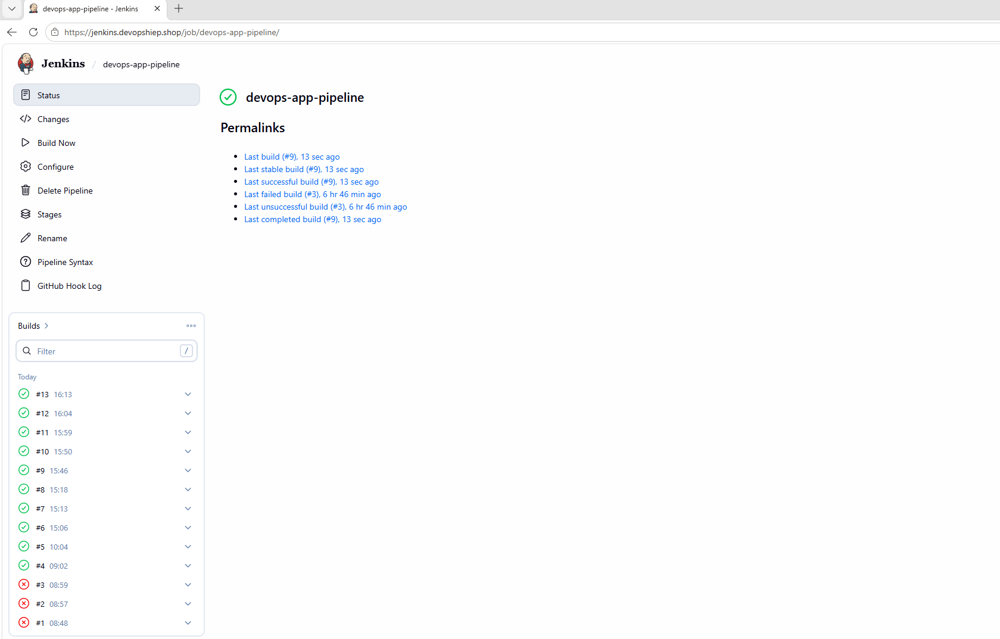

<h2 id="step-2">🔄 2. ArgoCD GitOps Auto-Sync</h2>

ArgoCD continuously reconciles the live cluster against the Git repository, automatically syncing on every new commit:

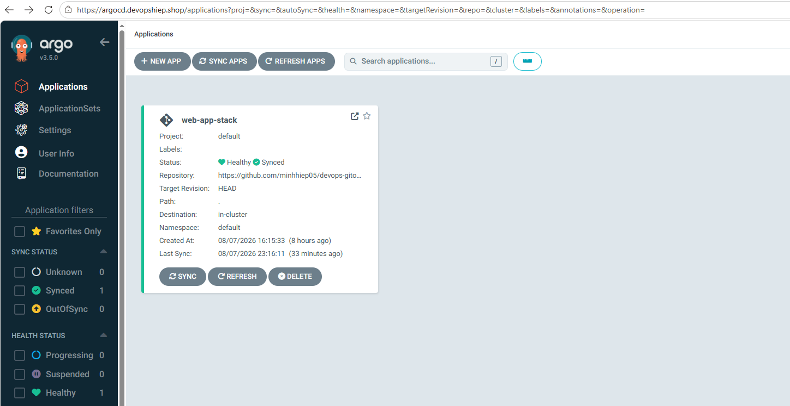
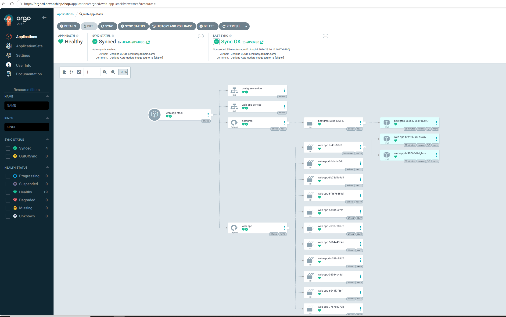

<h2 id="step-3">🔒 3. Custom Domain & Valid HTTPS Certificate</h2>

All three UIs are exposed over valid, auto-renewed TLS certificates via `cert-manager` + Let's Encrypt:
*   **Application**: `https://lab.yourdomain.com`
*   **ArgoCD**: `https://argocd.yourdomain.com`
*   **Grafana**: `https://grafana.yourdomain.com`

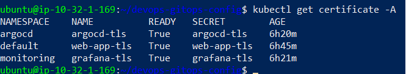
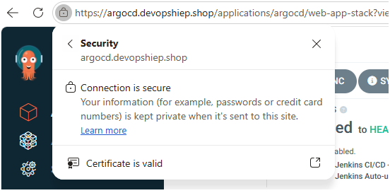
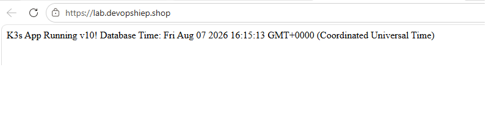

<h2 id="step-4">📊 4. Observability: Prometheus + Grafana + Loki</h2>

A custom Grafana dashboard visualizes pod count, per-pod CPU/memory usage, and live application error logs pulled from Loki:

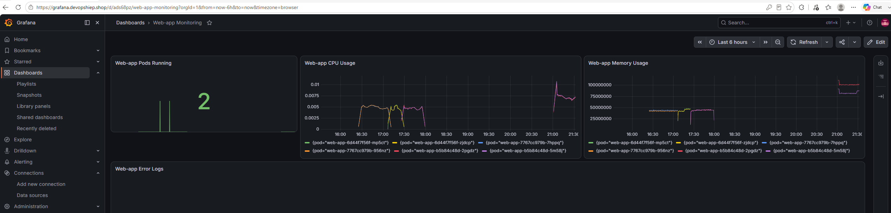
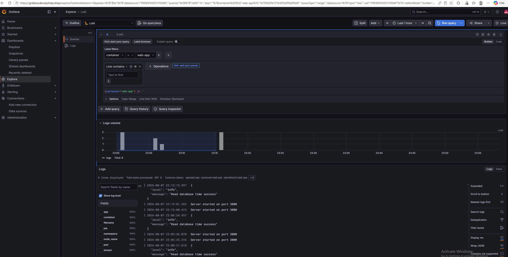

<h2 id="step-5">🌐 5. Live Application Demo</h2>

Cluster state and networking verified end-to-end:

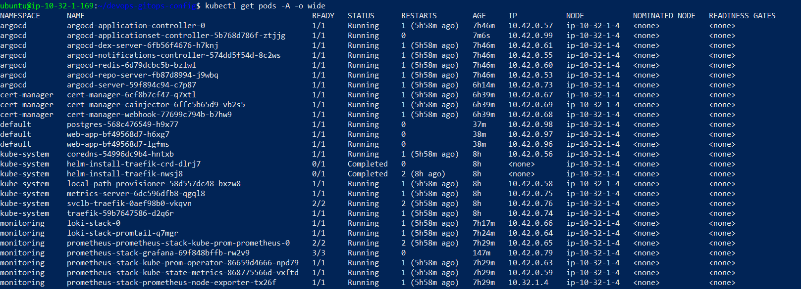
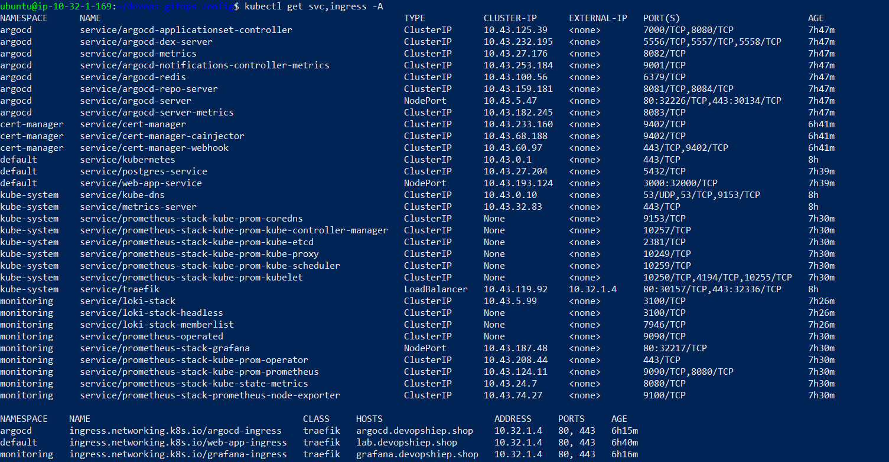

---

<h2 id="troubleshooting-lessons-learned">⚠️ Troubleshooting & Lessons Learned</h2>

Building this pipeline manually — without a managed CI/CD or Kubernetes service — surfaced a long list of real-world issues. Below are the 8 most significant ones, spanning security design, CI reliability, GitOps semantics, and observability internals:

| # | Problem | Root Cause | Fix |
|---|---|---|---|
| 1 | `ssh: connect to host <Target-IP> port 22: Connection timed out` when connecting directly from a local machine | By design, `SG-Target-K3s` only allows SSH from `SG-Management`, not from arbitrary external IPs | SSH into the Management Server first, then `ssh` from there into the Target Server using its private IP |
| 2 | `docker login` failed in the pipeline with `unauthorized: incorrect username or password`, even after generating a token | Two compounding issues: Docker Hub required a **Personal Access Token** instead of a password, and the Docker Hub username was actually different from the GitHub username hardcoded in the Jenkinsfile | Generate a Docker Hub Access Token (Read & Write) for Jenkins Credentials, and correct the real username consistently across `Jenkinsfile`, Credentials, and `web-app.yaml` |
| 3 | `fatal: destination path 'gitops-config' already exists and is not an empty directory` on subsequent builds | Jenkins reuses the same workspace across builds; a leftover clone from a previously failed run blocked the new `git clone` | Add `rm -rf gitops-config` immediately before the `git clone` step in the Jenkinsfile |
| 4 | ArgoCD deployed the app, but pods entered `ErrImagePull` / `ImagePullBackOff` | `web-app.yaml` still referenced the original placeholder tag/username, which was never actually pushed to the registry | Correct the `image:` field to a real, pushed tag, and let Jenkins overwrite it automatically on the next build going forward |
| 5 | All Grafana panels showed `No data` despite adding `prometheus.io/scrape` annotations | `kube-prometheus-stack` uses the Prometheus Operator, which discovers targets via `ServiceMonitor` custom resources — not legacy scrape annotations | Add a named port + labels to the Service, and create a matching `ServiceMonitor` with `release: <helm-release-name>` in its labels |
| 6 | Grafana's Loki data source failed health checks with `parse error at line 1, col 1: unexpected IDENTIFIER`, even though Loki itself was healthy (`/ready` returned `ready`) | The default Loki version bundled with the `loki-stack` chart was too old for the newer Grafana's health-check query syntax | `helm upgrade loki-stack grafana/loki-stack -n monitoring --reuse-values --set loki.image.tag=2.9.3` |
| 7 | `kubectl scale deployment postgres --replicas=0` (to simulate a failure) was silently reverted back to `replicas=1` within seconds | ArgoCD's Auto-Sync + Self-Heal actively reconciles any manual `kubectl` change back to what's declared in Git | Edit `replicas` inside the Git-managed YAML and push, instead of mutating the live cluster directly — the intended GitOps behavior |
| 8 | ArgoCD's own HTTPS (self-signed) conflicted with the Ingress-managed TLS certificate | ArgoCD server serves HTTPS internally by default, causing double TLS termination behind the Ingress | Patch the `argocd-server` Deployment to run with the `--insecure` flag, letting Traefik + cert-manager fully own TLS termination at the Ingress layer |

---

<h2 id="future-production-improvements">🔮 Production Gaps & Future Improvements</h2>

This project was built for educational and portfolio demonstration purposes on a single-node cluster. In a real-world production system, the following would be required:

- **High Availability**: Multi-node K3s/K8s cluster with a load-balanced control plane; PostgreSQL with replication and automated backups.
- **Secrets Management**: Replace plaintext credentials in YAML/Jenkinsfile with HashiCorp Vault, Sealed Secrets, or AWS Secrets Manager.
- **Infrastructure as Code**: Provision EC2 instances and Security Groups via Terraform instead of manual AWS Console steps.
- **Environment Separation**: Dedicated staging and production ArgoCD Applications with manual approval gates before production sync.
- **Automated Testing**: Unit and integration tests as a required pipeline stage before the Docker build.
- **Alerting**: Configure Alertmanager on top of the existing Prometheus stack for real incident notifications, not just dashboards.
- **Network Policies & RBAC**: Namespace isolation and least-privilege Kubernetes RBAC across all deployed components.

---

<h2 id="author">👤 Author</h2>

**Doan Minh Hiep**

*   **GitHub**: [@minhhiep05](https://github.com/minhhiep05)
*   **Email**: [doanhiep169@gmail.com](mailto:doanhiep169@gmail.com)
